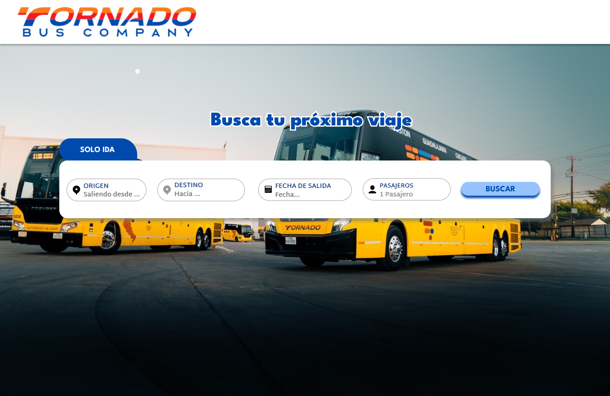
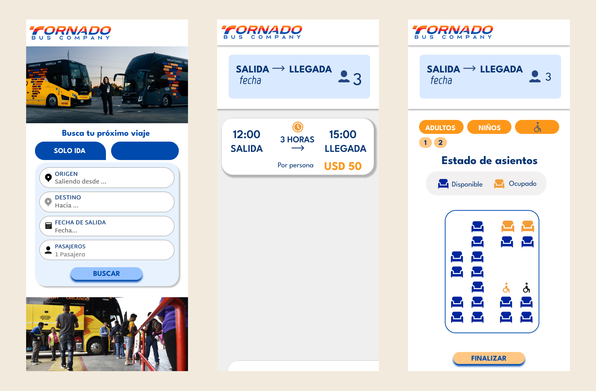

# Tornado Bus Company

## Índice

- [1. Descripción](#1-descripción)
- [2. Características](#2-características)
- [3. Tecnologías Usadas](#3-tecnologías-Usadas)
- [4. Instalación y Uso](#4-instalación-y-Uso)
- [5. Diseño](#5-diseño)
- [6. API](#6-api)

---

## 1. Descripción

El proyecto consiste en crear una aplicación web que permita a los usuarios buscar y reservar asientos de buses. Los usuarios podrán seleccionar sus asientos, teniendo en cuenta si algún pasajero tiene una discapacidad. Además, podrán buscar viajes disponibles, ver los horarios de salida, la duración del viaje y el precio. Finalmente, podrán elegir la mejor opción y comprar los boletos.

![Preview app]

## 2. Características

✔️ Búsqueda de rutas de autobuses  
✔️ Selección de fecha y hora de viaje  
✔️ Elección de asientos disponibles  
✔️ Integración con una API de viajes  
✔️ Diseño responsive  

## 3. Tecnologías Usadas

Este proyecto fue desarrollado con las siguientes tecnologías:  

- **React + TypeScript** (con Vite) ⚛️🚀 – Para la construcción de la aplicación frontend.  
- **Formik + Yup** 📋✅ – Para la gestión y validación de formularios.  
- **Styled Components**  – Para el diseño y estilización de los componentes.  
- **Axios** 🔗 – Para la comunicación con la API.  

## 4. Instalación y Uso

Sigue estos pasos para instalar y ejecutar el proyecto en tu entorno local.

### **1️⃣ Clonar el repositorio**
git clone https://github.com/tu-usuario/nombre-del-repositorio.git
cd nombre-del-repositorio
### **2️⃣ Instalar las dependencias**
npm install
### **3️⃣ Ejecutar el proyecto**
npm run dev

## 5. Diseño
El diseño de la aplicación es **intuitivo y responsivo**, asegurando una experiencia óptima en distintos dispositivos, desde computadoras hasta móviles.  

🔹 Se utilizó la paleta de colores de la marca para mantener coherencia visual.  
🔹 Se diseñó con una **experiencia de usuario fluida** y accesible.  

### 📌 Diseño en Figma  
Diseñé la interfaz en Figma para visualizar la estructura y experiencia del usuario.

🔗 [Ver los diseños en Figma](https://www.figma.com/design/Yga8yHDmoE0NioLgzJ6mmo/Untitled?node-id=87-1163&t=Mfv1hdbhrZXXoPdp-1) 

🔗 [Visualiza el flujo de uso(version Mobile)](https://www.figma.com/proto/Yga8yHDmoE0NioLgzJ6mmo/Untitled?node-id=87-1072&p=f&t=Mfv1hdbhrZXXoPdp-0&scaling=min-zoom&content-scaling=fixed&page-id=87%3A761) 
 
  
 

## 6. API

Este proyecto consume una API proporcionada para la prueba técnica. La API proporciona información sobre los viajes, asientos disponibles y otros datos relevantes.  

### 📌 Documentación de la API  

Puedes consultar la documentación completa de los endpoints aquí:  
[Endpoints Prueba Técnica - Mid Frontend Developer](https://continuous-bearskin-cd9.notion.site/Endpoints-Prueba-Tecnica-Mid-Frontend-Developer-1b92f4395b1180ffbf07cc1f9ab37ffb)  

### 🔹 Endpoints principales utilizados:

- **🔍 Obtener  ciudades de origen por alias**  
  **Método:** `POST`  
  **URL:** `https://discovery.local.onroadts.com/v1/web/select/origin`  
  **Descripción:** Permite buscar ciudades de origen utilizando un alias o parte del nombre de la ciudad.  

- **🚌 Obtener ciudades de destino por alias**  
  **Método:** `POST`  
  **URL:** `https://discovery.local.onroadts.com/v1/web/select/destiny/{cityInitId}`  
  **Descripción:** Permite buscar ciudades de destino utilizando un alias o parte del nombre de la ciudad.  

- **📍 Obtener tipos de pasajeros**  
  **Método:** `GET`  
  **URL:** `https://api.local.onroadts.com/v1/web/select/type`  
  **Descripción:** Obtiene la lista de tipos de pasajero disponibles para que la web pueda mostrar las opciones que el cliente puede seleccionar.  

- **✅ Listar viajes de salida**  
  **Método:** `POST`  
  **URL:** `https://discovery.local.onroadts.com/v1/web/list/departure-travels?isMultiRoute=true&isReturn=false`  
  **Descripción:** Permite listar los viajes de salida disponibles, aplicando filtros y paginación para optimizar la búsqueda de rutas.  

- **✅ Listar asientos disponibles**  
  **Método:** `GET`  
  **URL:** `https://api.local.onroadts.com/v1/web/list/seats/{travelId}/{cityInitId}/{cityEndId}`  
  **Descripción:** Devuelve la lista de asientos disponibles para un viaje específico, dado un origen y un destino.  

- **✅ Marcar asiento**  
  **Método:** `PUT`  
  **URL:** `https://api.local.onroadts.com/v1/web/list/seats/mark`  
  **Descripción:** Permite marcar un asiento como seleccionado en un viaje específico para garantizar su disponibilidad.  

### 🔗 Peticiones en el proyecto
Las peticiones a la API se manejaron con **Axios**, asegurando un manejo eficiente de las respuestas y errores.

---
